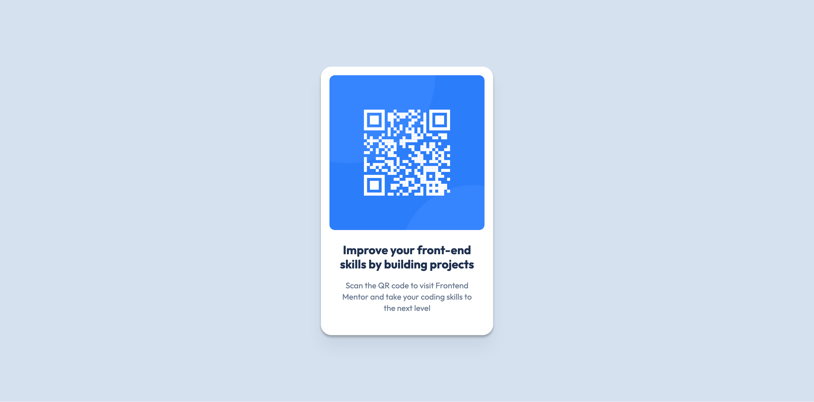

# Frontend Mentor - QR code component solution

This is a solution to the [QR code component challenge on Frontend Mentor](https://www.frontendmentor.io/challenges/qr-code-component-iux_sIO_H). Frontend Mentor challenges help you improve your coding skills by building realistic projects. 

## Table of contents

- [Overview](#overview)
  - [Screenshot](#screenshot)
  - [Links](#links)
- [My process](#my-process)
  - [Built with](#built-with)
  - [What I learned](#what-i-learned)
- [Author](#author)
- [Acknowledgments](#acknowledgments)

**Note: Delete this note and update the table of contents based on what sections you keep.**

## Overview

### Screenshot

### Links

- Solution: [github.com](https://github.com/batistan/qr-code-component/tree/main)
- Live Site: On [batistan.github.io](https://batistan.github.io/qr-code-component/)

## My process

### Built with

- Semantic HTML5 markup
- Flexbox
- Mobile-first workflow

### What I learned

- Semantic HTML tags

- Implementing Figma designs faithfully

## Author

- Website - [Nelson Batista](https://sorou.tech)
- Frontend Mentor - [@batistan](https://www.frontendmentor.io/profile/batistan)
- Bluesky - [@sorou.tech](https://bsky.app/profile/sorou.tech)
